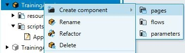
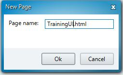
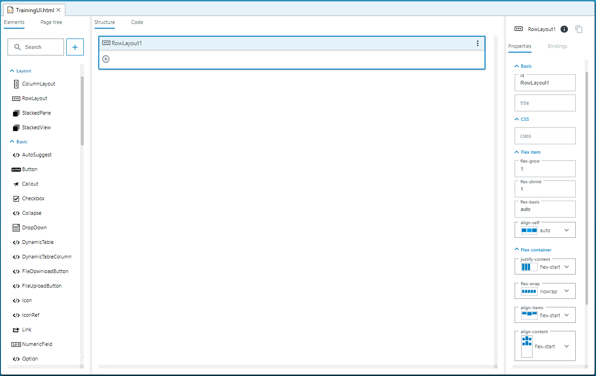
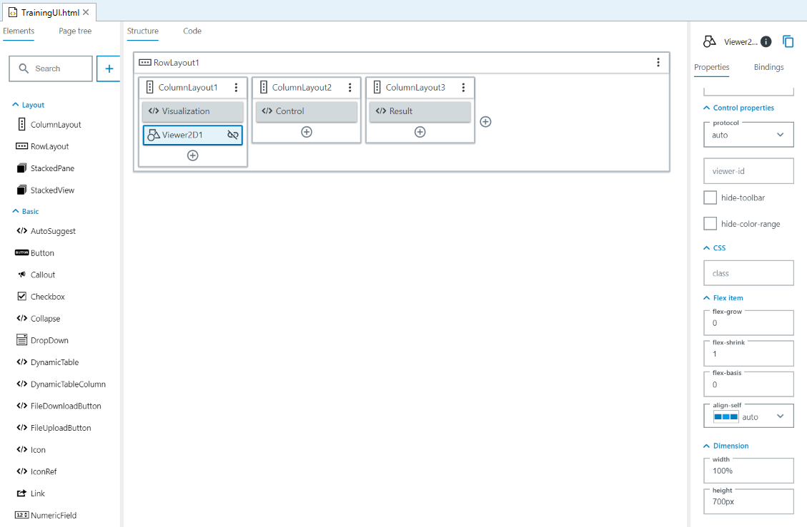
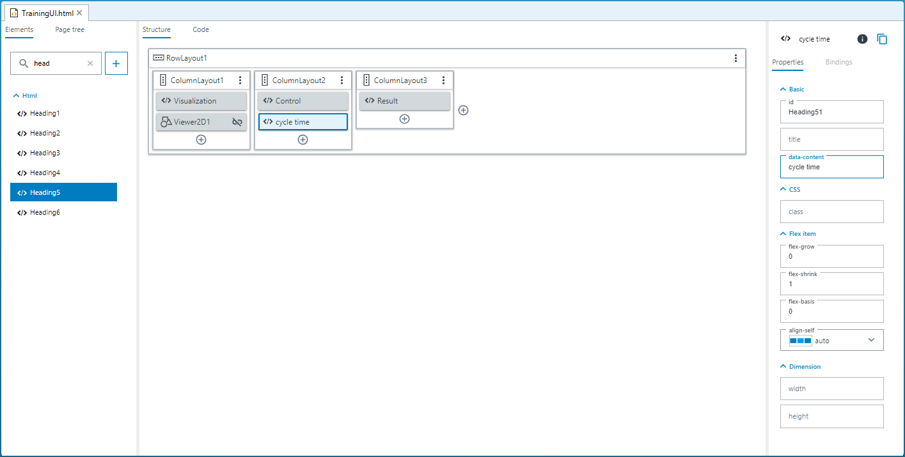
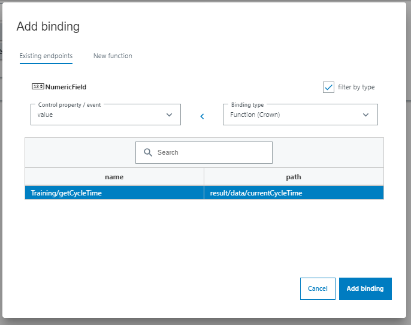
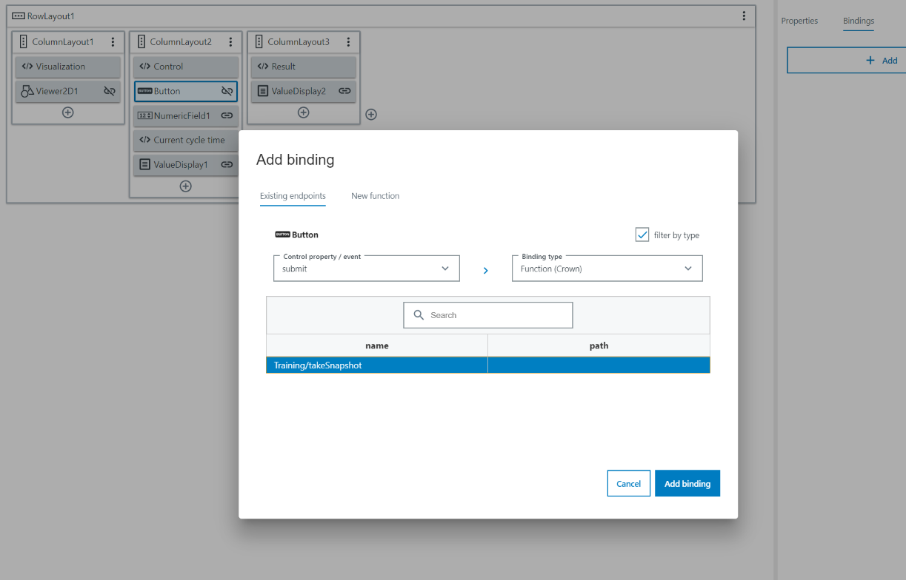

= UI-Builder: Application specific UI - a step by step example

# Introduction
In this turorial you will learn how to use the UI-Builder to craete customized UI pages for your sensor application. To do this, we will show you how to create an UI for a given app (_TrainingApp1_, download available in paragraph "Preparation").
Additional information and explanations can be found in the following tutorials: 

* link:https://supportportal.sick.com/tutorial/ui-builder2-application-specific-ui/[UI-Builder: Application specific UI]
* link:https://supportportal.sick.com/tutorial/ui-builder2-layouting/[UI-Builder: Layouting]
* link:https://supportportal.sick.com/tutorial/ui-builder2-bindings/[UI-Builder: UI Bindings]

The provided app _TrainingApp1_ receives images of barcodes, decodes them and returns their content. It includes functions to set the cycle time in which new images are received or to take snapshots immediately.

## Prerequisites
* Basic skills in SICK AppStudio, mainly how to connect to a device or emulator, deploy apps onto it and open the device page. Consider  link:https://supportportal.sick.com/tutorial/appstudio-introduction/[AppStudio introduction] or link:https://supportportal.sick.com/tutorial/appstudio-essentials/[AppStudio essentials] for more information.
//TODO: AppStudio essentials is missing the opportunity to open the device page in the browser yet.

# Goal:
Create a UI which will show the received images, show their content and bind to the other functions to make them easily accessible for the user.
 

Screenshot of the finished UI:

image::media/pageviewallcontrols.png[pageviewallcontrols]

# Preparation

* Download the training app: 
https://supportportal.sick.com/file/0483c6f0-0989-4ee0-9562-19e40f3f06ed/[TrainingApp1.zip]
* Open AppStudio, start the Emulator and connect to it.
* Import the downloaded app. (There are three possibilities to do this: use drag & drop, click "App" → "Import" or right click into some empty space in your working directory and choose "Import App")
* If you are interested in the code itself, you can open the source code in scripts/App1.lua.

# Creating the UI step by step

## Add a new page 

First, add a new page component to the App:

* Right-click onto the app → "Create component" → "pages"

* A dialog appears where you can enter a name for the new page. Name the page _TrainingUI_ and press OK.

* The UI-Builder opens automatically.

## Add main layout

Now, create a 3-column layout for the page and adjust the widths:

* Select _ColumnLayout_ from the "Elements" Area and drag it into _RowLayout1_

//video::media/columnlayoutintorowlayout.mp4[]
image::media/columns-new.png[]

* Repeat this step three times

* Select _ColumnLayout1_ and set flex-grow to 2, set flex-grow to 1 for _ColumnLayout2_ and _ColumnLayout3_. +
This will lead to a 2:1:1 ratio between the columns, which means that column 1 takes 50% of the available space and columns 2 and 3 take 25% each.

image::media/columnlayoutproperties_both.png[]

## Define Headings
The next step is to add headings to the columns. Search for _Heading4_ in the "Elements" section and drag one display into each column layout.

Set the data-content of

* the first heading to _Visualization_
* the second heading to _Control_
* the third heading to _Result_

## Add the viewer

After the layouting is done, you are ready to fill the columns with content.

Search for _Viewer2D_ and drag it into the first column. Set the "height" property (last element in the "Properties" tab on the right) of the _Viewer2D_ element to _700px_.

If you run the App now, you see that the visualization control shows images of barcodes.

_Sidenote: If you look into the lua code, you see that we created a viewer there and added every new image to it. This viewer automatically connects to the viewer from the UI via a default-id:_

----
local viewer = View.create()

...

-- Function is called everytime a new image is provided
--@handleOnNewImage(image:Image,sensorData:SensorData)
local function handleOnNewImage(image, sensorData)
  Log.info("New image received")

  -- Adding image to viewer and update
  View.addImage(viewer, image)
  View.present(viewer)

  -- Variable to store content string
  local content = "[No code found]"

...
----

## Add numeric field to configure the cycle time

If you want to change the cycle time in which new pictures are taken, the code offers a function to do that. Connect the UI to this function:

* Insert a _Heading5_ to the second _ColumnLayout_ and set its _value_ property to "cycle time".
* Insert a numeric field into _ColumnLayout2_
* Set the 
** _min_ property to 20
** _max_ property to 10000
** _unit_ property to ms
* Click onto the binding symbol on _NumericField1_ or switch to the "Bindings" tab and then click "+ Add" to add a new binding
* In the binding dialog:
** Select "change event" as Control property / event
** Select "Training/setCycleTime", then click "Insert Binding" to insert the binding

//video::media/numericfieldwithbinding.mp4[]

image::media/numericfield.png[numeric1_4, 800]
image::media/numericfield-binding.png[numeric5_8, 800]

## Show the current cycle time 

Until now, the numeric field will always show the default value (which is the min value) on reload. To show the current cycle time instead, add another binding which sets the value to the current cycle time:

* Select the _NumbericField_ and open the binding dialog.
* In the binding dialog:
** Select Control property "value"
** Select the binding type "Function (Crown)" (you may need to disable the _filter by type_ checkbox)
** Make sure that "Training/getCycleTime" is selected
** Click "Insert Binding"

## Add value display to show result of barcode scan

It would be nice to see not only see the barcodes, but also their content. Add a _ValueDisplay_ to show the content:

* Add a _ValueDisplay_ to column 3 and open the binding dialog.
* In the binding dialog:
** Select property "value" and binding type "Event (CrownEDPWS)""
** Make sure that "Training/OnProcessingFinished" is selected
** Click "Insert Binding"

//video::media/resultdisplayadded.mp4[]
image::media/BindingQR.png[]

## Add button to take snapshots

Add a button to be able to take snapshots:

* Add a button to the second column
* Change data-content to "take snapshot"
* Open the binding dialog, choose property "submit" and bind it to "Training/takeSnapshot"

//video::snapshotbuttonadded.mp4[]

# Resulting App

The final app can be downloaded here:

https://supportportal.sick.com/file/910ba0d5-9c74-4119-9423-e15f69de3b8d/[TrainingAppComplete.zip]

# Download Tutorial as PDF